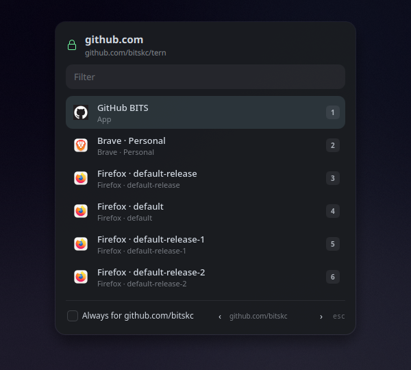
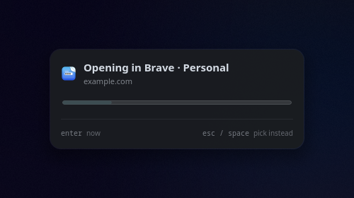
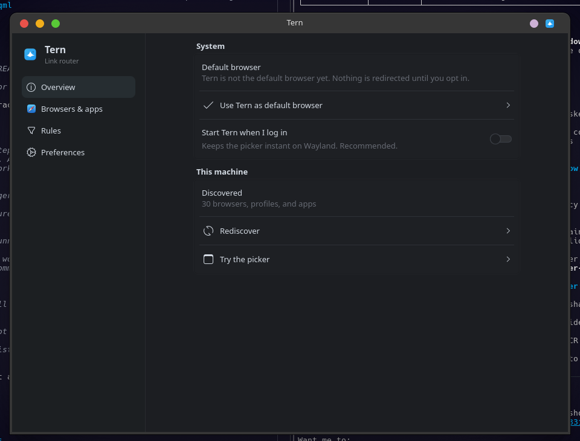

# Lane

Lane is a link router for KDE Plasma. It becomes your default browser,
then sends each click to the right browser profile, web app, or custom
handler.

If you run Zen for personal stuff, Firefox for work, and a GitHub PWA
for repos, Lane sorts that out without you thinking about it.

It is a Qt 6 + Kirigami app that stays running in the background, so the
picker shows up instantly on Wayland. Same idea as Browser Tamer, Choosy,
or Velja, but native to Plasma.


*The overlay you get when Lane does not already know where to send a link.*


*The hold bar when enabled in Preferences. Press Enter to go now, Esc or Space to pick instead.*


*Overview page: default browser, autostart, and discovered targets.*

## Releases

The version you have lives in [GitHub Releases](https://github.com/bitskc/lane/releases).
What changed between versions is in [CHANGELOG.md](CHANGELOG.md). Run
`lane --version` to check what's installed.

## What it does

Lane discovers Gecko profiles (Firefox, Zen, LibreWolf, Floorp, Waterfox)
and Chromium profiles (Brave, Chrome, Edge, Vivaldi, Opera), plus
`firefoxpwa` sites. Flatpak-installed browsers are discovered too; their
profiles live under `~/.var/app/<app-id>/`. Desktop `Name=` wins over the
PWA manifest name.

Zen and Firefox containers (contextual identities) show up as
destinations too, wherever `containers.json` exists and the browser
has a protocol-handler extension installed to act on them.

Decision order: rules first, then remembered destination, then unique
PWA if you prefer PWAs, then picker policy, then default.

Remembered destinations are path-scoped, not just host.
`github.com/bitskc` can go somewhere different from `github.com`. PWA
auto-open respects scope, so an origin-wide PWA scope like
`https://github.com/` does not grab tenant paths like `github.com/bitskc`.

Optional hold bar: when enabled in Preferences, Lane pauses for about 1.6
seconds before opening from a remembered choice, a unique PWA, or the default
target, so you can stop it. Explicit rules skip the hold and open immediately.

Opt-in default browser. Lane does not take mailto or PDF. Security: http
and https only. Lane rejects `file`, `javascript`, `data`, and URLs with
embedded credentials. Custom handlers run as argv, not through a shell.

## Tutorials

### First run

After you build and install:

1. Open Lane from your app menu. The settings window opens on the
   Overview page.
2. Turn on "Start Lane when I log in". This keeps the daemon running so
   the picker shows up instantly.
3. Click "Use Lane as default browser" when you are ready. Lane takes
   http and https only. mailto and PDF stay with their own apps.
4. Not ready to commit? Click "Try the picker" on the Overview page. It
   opens the overlay with a sample URL so you can see how it works
   without making Lane your default.
5. Click "Rediscover" if you install or remove a browser after the first
   run.

### Pick a destination

Say you click a link to `https://github.com/bitskc/lane`. Lane does not
know where you want it yet, so the picker overlay appears.

1. Press 1 through 8 to pick a target by number. Or type to filter the
   list, then press Enter to confirm.
2. Press Esc to cancel and do nothing.
3. To remember this choice, press Alt+A or check "Always for
   github.com/bitskc". Next time you open a link to that destination,
   Lane skips the picker and opens it there directly.
4. The checkbox remembers the path, not just the host. Checking "Always
   for github.com/bitskc" remembers `github.com/bitskc` by default, not
   all of `github.com`. Press comma to narrow the path further, for
   example down to a specific repo. Press period to widen it back out.
   The chevrons in the footer do the same thing with the mouse.

### Stop a silent open

When Lane opens a link from a remembered choice, a unique PWA, or the
default target, it shows a hold bar for about 1.6 seconds before
launching.

1. The bar says "Opening in" followed by the target name, with a
   progress bar underneath.
2. Press Enter to open now, without waiting.
3. Press Esc or Space to cancel the hold and show the picker instead.
4. Written rules skip the hold and open immediately.
5. Turn the hold off in Preferences. Switch off "Pause before opening"
   to launch right away with no hold bar.

### Teach it a rule

Rules send a link to a specific target without asking. You can add them
in the settings window or by editing the config file.

To add a rule in the UI:

1. Open Settings and go to the Rules page in the sidebar.
2. Click "Add rule".
3. Set "When the link matches" to `github.com/bitskc`.
4. Set "Look at" to "Path".
5. Set "Open in" to your work profile.
6. Make sure "Enabled" is on.

Now any link to `github.com/bitskc` opens in that profile. No picker, no
hold.

To add a rule by hand:

1. Run `lane --list` to get the target ID for your work profile.
2. Run `lane --explain https://github.com/bitskc/lane` to confirm the
   URL matches your pattern.
3. Edit `~/.config/lane/config.json` and add a rule object to the
   `rules` array with the pattern, scope `"path"`, and the target ID.
4. Run `lane --rediscover` so the running daemon reloads the file. Or
   restart the daemon if you prefer a clean process:

```bash
lane --rediscover
# or:
pkill -f "lane --daemon"
lane --daemon &
```

For Claude Code, Codex, and similar agents, see `AGENTS.md` for the full
config shape and CLI inspection commands.

## Config

`~/.config/lane/config.json` is the source of truth. The settings window
writes the same file. If you edit it by hand, run `lane --rediscover` to
reload the file and rescan targets in the running daemon. Restarting the
daemon (`pkill -f "lane --daemon"` then `lane --daemon &`) still works if
you want a clean process.

## CLI

```
lane                              # open settings
lane --version                    # print the installed version
lane --help                       # print usage
lane --daemon                     # run in background, no window
lane https://example.com          # route a URL
lane -p https://example.com       # force the picker
lane --pick https://example.com   # force the picker
lane --explain https://claude.ai  # print the routing decision
lane --config-path                # print the config file path
lane --list                       # print discovered targets
lane --settings                   # open settings
lane --configure                  # alias for --settings
lane --rediscover                 # rescan browsers and refresh targets
```

## Build (CachyOS / Arch)

For a system-wide install, use the PKGBUILD in `packaging/`:
`cd packaging && makepkg -si`. An AUR package is planned.

To install under `$HOME/.local` instead:

```bash
sudo pacman -S --needed cmake extra-cmake-modules ninja qt6-base qt6-declarative qt6-svg \
  kirigami kirigami-addons ki18n kcoreaddons kconfig kdbusaddons knotifications \
  kwindowsystem kiconthemes kcolorscheme kcrash kstatusnotifieritem layer-shell-qt \
  qqc2-desktop-style
cmake -S . -B build -G Ninja -DCMAKE_BUILD_TYPE=Release -DCMAKE_INSTALL_PREFIX="$HOME/.local"
cmake --build build
ctest --test-dir build --output-on-failure
cmake --install build
update-desktop-database "$HOME/.local/share/applications"
```

`appstreamtest` only runs after `cmake --install`; before that it reports
"Not installed yet, skipping".

The install prefix is baked into the desktop and service files, so the
launcher finds the binary even when `$HOME/.local/bin` is not on PATH.
Run `update-desktop-database` after installing so the menu picks up the
new entry.

Launch Lane from the app menu, then click "Use Lane as default browser".
Turn on "Start Lane when I log in" so the first click is instant.

## License

Source is available under the PolyForm Noncommercial License 1.0.0.
Personal and hobby use is free. Using Lane in a product you sell needs a
commercial license. See [COMMERCIAL.md](COMMERCIAL.md) for details.
